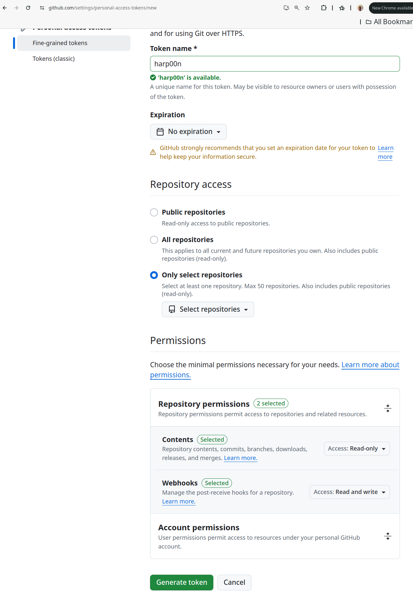
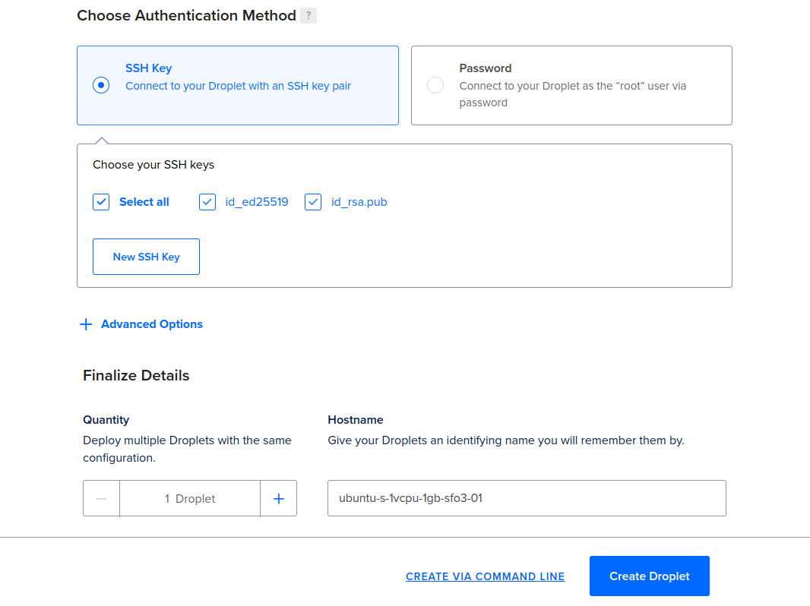
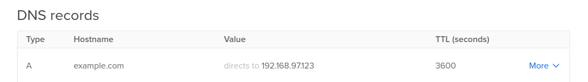
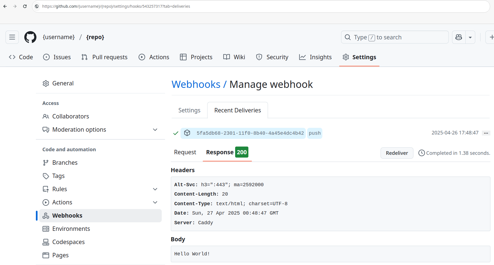

# HARP00N

One script to setup for push to deploy.

## Harp00n Manifesto

Zero-friction code deployment. Full control. No dashboards. No configs. One script.

- Prefer **console over clicks**
- Expect **production-ready** servers in seconds
- Trust **GitHub** as source of truth
- Want to run everything in **Containers**
- Love tools they can **read in one screen**
- Believe **SSL Certificate handling** should require no work

## How it Works?

Harp00n is a bash script that sets up your fresh new Linux host (Ubuntu 24.10 or later)
in such a way that when you commit to github, your code it automatically pulled and updated.
It also automatically obtains an SSL certificate and sets up a GitHub webhook for you.

Your deplyment can can be a simple web server or a more complex set of containers.

We do not dictate what your code does but we provide examples of how to
deploy containers using Harp00n.

### Steps

1. You create a github repo containing the code you want to deploy (including the harp00n-run.sh as explained below)

2. You obtain a github token with permission to clone the repo and setup webhooks

   

3. You provision a new Linux host (we only support Ubuntu 24.10 or later at this time). For example on DigitalOcean:

   

   

   

4. Setup a DNS record for your host.

   

5. You download and run once harp00n on the host (this is the only command)

   ```bash
   curl https://raw.githubusercontent.com/unofficialtools/harp00n/refs/heads/main/harp00n.sh | bash -s -- --domain={yourdomain} --repository={username}/{reponame} --github_token={yourtoken}
   ```

6. **Done!**

7. Try push something the "production" branch of your repo. Every time you push to branch "production", harp00n will grab it and run "harp00n-run.sh" from within your repo. This script should run (not start, run!) the service. If a web service listen to port 8000.

8. Check your webhook page after deployments:

   

The source is [here](https://github.com/unofficialtools/harp00n) but no need to clone it to use it.


### harp00n-run.sh

harp00n-run.sh is a file that must be at the root of the repo you want to deploy.
It could be as simple as:

    mkdir -p static
    echo "hello world" > static/index.html
    uv run python -m http.server 8000 -d static

After commit to the production branch, your page will be available at https://{yourdmain}/index.html

Here are some requirements:

- It must block while the service runs
- It shoud not prompt the user
- It could run a container using podman or podman-compose (without -d option)
- If you start a web server, use port 8000, and harp00n will proxy from https automatically
- You can count on [uv](https://docs.astral.sh/uv/), [podman](https://podman.io/), and [podman-compose](https://docs.podman.io/en/latest/markdown/podman-compose.1.html) installed by harp00n
- If you use podman or podman compose make sure to use "network-mode: pasta" or your service will be blocked by the firewall.

Ideally everything you want to run on the server will be in containers (run via podman)
and init.sh should contain the commands to start/restart the containers.


### So how do I deply again?

```
git push origin production
```

Yes. That's it. 

### Concrete examples

https://github.com/unofficialtools/harp00n-examples/

- A simple python server for static files [python-http-server](https://github.com/unofficialtools/harp00n-examples/tree/python-http-server)
- A Flask service [flask-simple](https://github.com/unofficialtools/harp00n-examples/tree/flask-simple)
- A py4web service [py4web-simple](https://github.com/unofficialtools/harp00n-examples/tree/py4web-simple)
- A py4web service using a Dockerfile with Podman [docker-podman-py4web-simple](https://github.com/unofficialtools/harp00n-examples/tree/docker-podman-py4web-simple)
- A py4web service using a docker-compose.yaml with Podman [docker-podman-py4web-compose](https://github.com/unofficialtools/harp00n-examples/tree/docker-podman-py4web-compose)

To test the examples:

1. Fork and clone git@github.com:unofficialtools/harp00n-examples.git
2. Configure your server as explained above and make it point to your new forked repo.
3. Run locally:

   ```
   git checkout production
   git reset --hard python-http-server
   git push --force origin production
   ```

### Caveats

- The deplyed code will be under /user/share/harp00n/checkout
- harp00n-run.sh will run as user harp00n which does not have sudo access
- We use Podman instead of Docker to avoid running as root

### Where are my logs?

- The deployment logs are stored in github under the webhooks for your repo.
- Harp00n will logs its own service (which uses localhost:8111) to /var/log/harp00n/8111/current
- Harp00n will logs the output of harp00n-run.sh (which uses localhost:8000) to /var/log/harp00n/8000/current
- For both logs it performs automatic rotation.


### Backward compatibility?

This tool is new and constantly improving, so check this page before using it.
Nevertheless, you are only supposed to setup the script once to setup your system.
So even we change harp00n, we do not break your workflow.

### License

[BSD 3-Clause](https://opensource.org/license/bsd-3-clause)